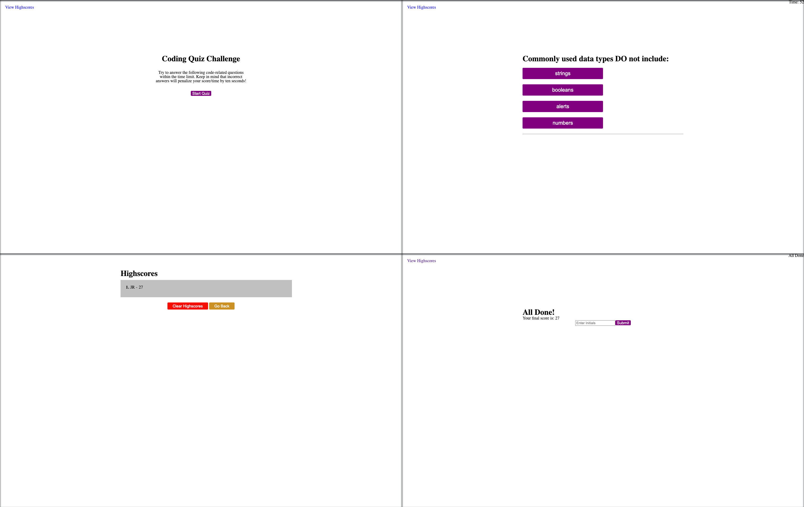

# Code quiz

## Description
This project creates a timed quiz in which the seconds go down if wrong. When quiz is finished the seconds remaining is the score that you get. This score will be stored in order to view highscores later. In its current state the scores are local only. 

## Installation

N/A

## Usage
A quiz to test knowledge and speed of knowledge. 

## Deployment
https://joshrthedeveloper.github.io/Code-quiz/

#### Screenshot
.

## Credits

Reset provided by: http://meyerweb.com/eric/tools/css/reset/
Net Ninja for reviewing JavaScript: https://netninja.dev/
Brian Design for reviewing vanilla JavaScript - CSS styles: https://www.youtube.com/watch?v=f4fB9Xg2JEY

## License
Please refer to the MIT LICENSE.
